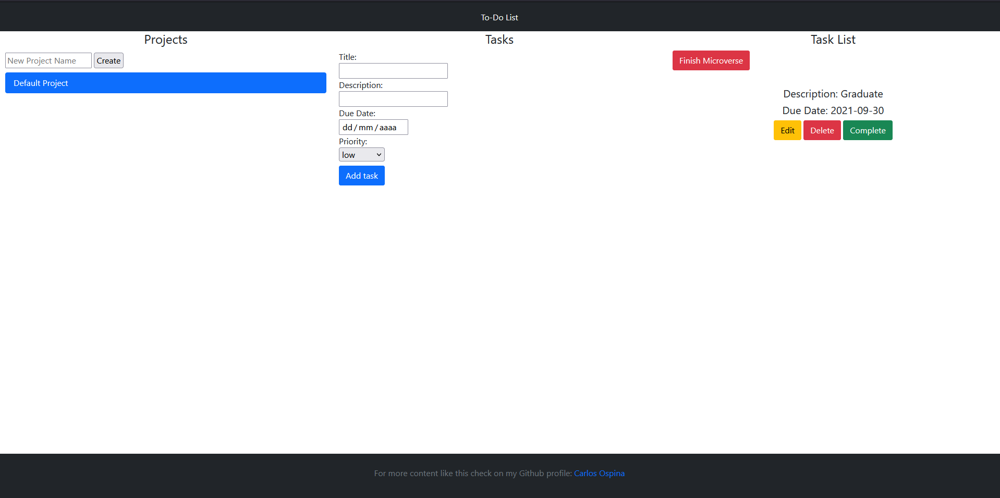

# Todo-List With Javascript

> This project is part of Javascript 1.1 Module with the aim of building a Todo list web application with localstorage.

<p align="center">
    <a href="https://img.shields.io/badge/Microverse-blueviolet" alt="Contributors">
        </a>
    <a href="https://www.javascript.com/" alt="JS">
        </a>
    <a href="https://webpack.js.org//" alt="Webpack">
        </a>
    <a href="https://eslint.org/" alt="Eslint">
        </a>
    <a href="https://stylelint.io/" alt="Stylelint">
        </a>
</p>

<br/>

<b>Todo List </b> The main goal of this project is to understand the benefits of modularized code as well as the ability to set up a javascript application The lesson showing the concepts of “Single Responsibility” and “Tightly Coupled Objects”.



## Watch the Live Version

[Live Demo](https://rawcdn.githack.com/carloso0114/todo-list-js/7a9da8cfc4a4b87dc653716015f8da8c9817769d/dist/index.html)

### Prerequisites

- JavaScript ES6
- Text Editor
- Git
- NodeJS
- Webpack

## Getting Started

1. Open Terminal.
2. Navigate to your desired location to download the contents of this repository.
3. Copy and paste the following code into the Terminal :
   ```bash
   $ git clone https://github.com/carloso0114/todo-list-js/tree/feature-todo-list
   ```
4. Run `cd todo-list-js`
5. Install the needed dependencies 
    ```bash
    $ npm install
    ```
6. run
    ```bash
    npm run build
    ``` 
    to bundle scripts with **_webpack_** a static module bundler for modern JavaScript applications

### Usage
Lauch the local version of this project opening the `dist/index.html` file in the browser

## Contributing

This project was created for educational purposes as part of the Microverse web development curriculum; contributing is not accepted.

Feel free to check the [issues page](https://github.com/carloso0114/todo-list-js/issues).

## Author

👤 **Carlos Ospina**

- Github: [@carloso0114](https://github.com/carloso0114)
- Linkedin: [Carlos Ospina](https://www.linkedin.com/in/carlosospina/)
### Show your support

Give a ⭐️ if you like this project!

## License

This project is licensed under the MIT License